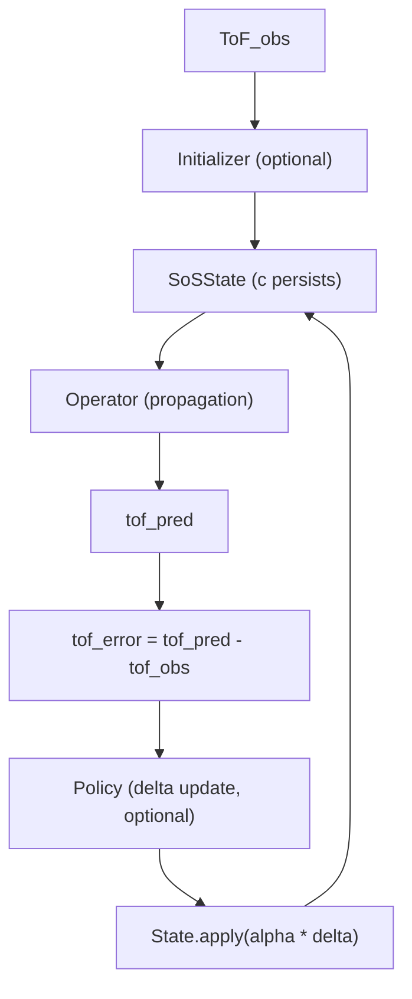

# PINN Tomography Architecture

This document captures:
1. The target unified architecture (canonical).
2. The current execution paths and where they diverge from the canonical design.

## Canonical Contracts (target)

### State (persisted)
`SoSState` is the only object that persists across steps. The state holds the SoS field `c` and step metadata, and it is updated via:
- `state.apply(delta) -> new_state`

### Operator (physics-inspired solver core)
The operator is a callable:
- `tof_pred = operator(state, observation_graph)`

It owns propagation logic only. It does not own training orchestration.

### Initializer (optional)
Initializer proposes an initial state from the observation and then exits:
- `state = initializer(observation)`

### Policy / Optimizer (optional learned update rule)
Policy proposes a *delta update*, not a final solution:
- `delta = policy(state, observation, tof_error, context)`
- `state = state.apply(alpha * delta)`

### Objective (loss composition)
Losses are composed in one place (not inside models):
- `loss_dict = objective(batch, rollout_output)`

## Canonical Main Loop

```text
ToF_obs
  -> Initializer (optional) -> c0_state
  -> repeat T steps:
       tof_pred = Operator(c_state)
       tof_error = tof_pred - ToF_obs
       delta_c = Policy(tof_error, state, priors/context)   # optional in early phases
       c_state = c_state.apply(alpha * delta_c)
  -> final c_state
```

## Canonical Data Flow (Mermaid)



## Current Code Paths (audit / discrepancies)

### Stage 1 and Stage 2 bypass the unified `TomographySystem` loop
- Stage 1 (legacy calibration):
  - `src/tomo/training/stage1_operator_baseline.py` and `src/tomo/training/stage1_search.py`
  - These implement derivative-free optimization using `src/tomo/operators/matlab_fmm_wrapper.py::forward_tof()` directly as the oracle.
  - They do not train or invoke `GATFMMOperator` via `TomographySystem`.

- Stage 2 (legacy RL):
  - `src/tomo/stage2/*` and `scripts/train_stage2.py`
  - `src/tomo/stage2/stage2_env.py::Stage2Env.step()` calls `forward_tof()` directly and manages `c_current` as a local `np.ndarray`.
  - It bypasses:
    - `src/tomo/systems/tomography_system.py::TomographySystem`
    - `SoSState.apply()` update contract
    - the unified operator/policy interface

### RL wrapper exists, but Stage2 RL does not use it
- `src/tomo/policies/rl_wrapper.py` implements:
  - `TomoEnv` backed by `TomographySystem`
- Stage 2 uses:
  - `Stage2Env` / `Stage2Trainer` in `src/tomo/stage2/`

### Naming/role collision: “operator baseline” is not operator-only training
- `src/tomo/training/stage1_operator_baseline.py` is named as if it is an operator training baseline, but its logic is calibration search (FMM oracle), not end-to-end `Operator` learning.

### Placeholder contract risk in `TomographySystem`
- `src/tomo/systems/tomography_system.py` includes logic that flattens or reshapes `tof_observed` in a stub-y way.
- Later agents should treat this as an interface scaffold, and ensure objective/graph shapes become consistent before assuming scientific correctness.

## How to use this doc
When implementing a “new phase”:
- Update the canonical loop only if the master plan changes.
- Add discrepancies under “Current Code Paths (audit)” with direct file pointers.
- Prefer to integrate logic into the canonical modules rather than extending bypass paths.

